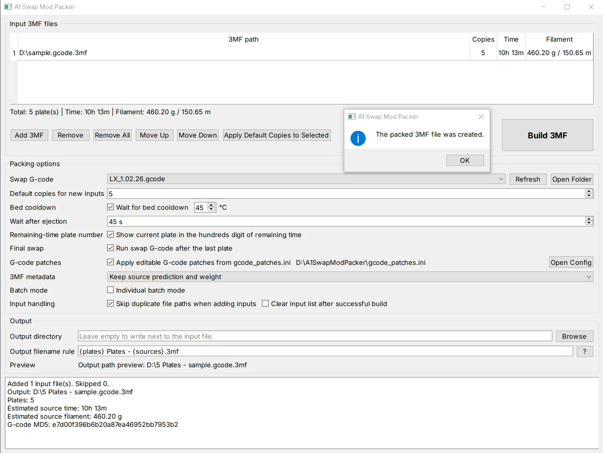

# A1 Swap Mod Packer

A1 Swap Mod Packer is an open-source implementation 3MF packer for Bambu Lab A1 SwapMod workflows.

It takes one or more A1-sliced `.3mf` files, repeats their plate G-code according to copy counts, inserts an external SwapMod ejection/swap G-code block, and writes a new packed `.3mf` that can be sent to the printer.




## Notes

- This project contains no proprietary code. All functionalities were implemented independently by comparing the states before and after 3MF file generation.
- Currently, this project has only been tested and verified on Windows 10. 
- Always test a generated file on a safe/simple print before using it in production.

## Key features

- GUI for drag-and-drop batch packing.
- CLI for repeatable automation.
- Multiple input `.3mf` files.
- Per-file copy count.
- Automatic time and filament summary from `Metadata/slice_info.config`.
- External SwapMod G-code template folder.
- Editable G-code patch file.
- Optional remaining-time plate-number encoding through `M73 R...`.
- Combined mode: all input rows become one packed 3MF.
- Individual batch mode: every input row becomes its own packed 3MF.
- zlib-ng Deflate ZIP compression level, defaulting to Level 7.
- GUI settings are saved to the program folder as `settings.json`.

## Installation for source use

Python 3.10 or newer is recommended.    

Install dependency:

```bash
pip install -r requirements.txt
```
Run the GUI:

```bash
python -m a1_swap_mod_packer.gui
```

or  

```bash
python run_gui.py
```

Run the CLI:

```bash
python -m a1_swap_mod_packer.cli --help
```

or

```bash
python run_cli.py
```

## Swap G-code templates

The GUI automatically scans this fixed folder:

```text
swap_gcode/
```

Plain UTF-8 G-code files are read directly.

In the GUI:

1. Put template files in `swap_gcode/`.
2. Click **Refresh** next to **Swap G-code**.
3. Select the template from the dropdown.

## Editable G-code patches

The GUI and CLI read the fixed patch file:

```text
gcode_patches.ini
```

Default rule:

```ini
[patch.a1_start_y]
enabled = true
flag = G0 X128 F30000
find = G0 Y254 F3000
replace = G0 Y250 F3000 ; Patched
max_count = 1
```

Meaning:

- Search after the optional `flag` line.
- Replace the first matching `find` line with `replace`.
- Apply at most `max_count` replacements.

You can disable this in the GUI with **G-code patches**, or edit the INI file and keep the option enabled.

The swap insertion marker can also be edited:

```ini
[swap]
insert_before_marker = ;=====printer finish  sound=========
```

## GUI guide

### Input 3MF files

The input table supports:

- **Add 3MF**: choose one or more `.3mf` files.
- Drag and drop `.3mf` files into the table.
- Drag and drop a folder into the table. The GUI adds top-level `.3mf` files from that folder.
- **Remove**: remove selected rows.
- **Remove All**: clear the full input list.
- **Move Up / Move Down**: change input order.
- **Apply Default Copies to Selected**: overwrite selected rows with the current default copy count.

Columns:

- **3MF path**: source file path.
- **Copies**: how many times this source should be repeated.
- **Time**: estimated print time multiplied by copies.
- **Filament**: estimated filament multiplied by copies.

The time and filament values are read from:

```text
Metadata/slice_info.config
```

If the source 3MF lacks this metadata, the GUI shows `Unknown`.

The summary line under the input list shows the total plate count, estimated time, and filament for the current table.

### Build 3MF button

The **Build 3MF** button is placed below the input list on the right side for fast batch operation.

In normal combined mode, one click creates one output 3MF containing all input rows.

In individual batch mode, one click creates one output 3MF per input row.

### Swap G-code

Selects the ejection/swap G-code block inserted into each repeated plate.

The dropdown is generated from files in:

```text
swap_gcode/
```

Buttons:

- **Refresh**: rescan the folder.
- **Open Folder**: open the template folder.

### Default copies for new inputs

Sets the default copy count applied to newly added or dragged-in files.

This does not automatically change existing rows. Use **Apply Default Copies to Selected** for existing rows.

### Bed cooldown

Controls whether the tool inserts a bed temperature wait before the SwapMod G-code block.

Enabled example:

```gcode
M190 S45
```

If disabled, no `M190` line is added by the packer.

### Wait after ejection

Adds a dwell after the SwapMod G-code block.

Example for 45 seconds:

```gcode
G4 P45000
```

### Remaining-time plate number

When enabled, the packer offsets `M73 ... R...` remaining-time values by:

```text
plate_number × 100 hours × 60 minutes
```

This allows the A1 remaining-time hour hundreds digit to display the current plate number.

Example concept:

- Plate 1: +6000 minutes
- Plate 2: +12000 minutes
- Plate 3: +18000 minutes

### Final swap

When enabled, the swap/ejection block is also inserted after the final repeated plate.

When disabled, the final repeated plate ends normally without running the swap G-code block.

### G-code patches

Applies rules from:

```text
gcode_patches.ini
```

The **Open Config** button opens that fixed file for editing.

### 3MF metadata

Options:

- **Keep source prediction and weight**  
  Leaves `slice_info.config` prediction and weight values from the base 3MF unchanged. This best matches the observed vendor packer behavior.

- **Sum prediction and filament**  
  Updates the first plate metadata using the sum of all repeated source plates. This is more logically correct for statistics, but may differ from the vendor software.

### Batch mode

#### Combined mode

Default behavior.

All input rows are packed into one output file.

Example:

```text
A.3mf copies 2
B.3mf copies 3
```

Output:

```text
one packed 3MF containing A, A, B, B, B
```

#### Individual batch mode

When enabled, the GUI shows an explanation popup.

Every input row is treated as an independent build.

Example:

```text
A.3mf copies 5
B.3mf copies 5
C.3mf copies 5
```

Output:

```text
5 Plates - A.3mf
5 Plates - B.3mf
5 Plates - C.3mf
```

This is intended for quickly converting a large batch of independent single-plate 3MF files into multi-copy SwapMod packs.

It does **not** combine all inputs into one file.

### Input handling

Options:

- **Skip duplicate file paths when adding inputs**  
  Prevents accidentally adding the same path multiple times.

- **Clear input list after successful build**  
  Clears the table after a successful build. In individual batch mode, the list is cleared only if all outputs are built successfully.

### Output directory

If this field is empty:

- Combined mode writes next to the first input file.
- Individual batch mode writes each output next to its own input file.

If a directory is selected, all outputs go to that directory.

### Output filename rule

Default:

```text
{plates} Plates - {sources}.3mf
```

Click the `?` button next to the rule field to show token help.

Available tokens:

| Token | Meaning |
|---|---|
| `{source}` | First input file stem, without `.3mf` |
| `{sources}` | Source summary. One source uses its stem; multiple sources become `first_source_and_N_more` |
| `{plates}` | Total plate count in this output |
| `{copies}` | Total copy count in this output |
| `{date}` | Current date as `YYYYMMDD` |
| `{time}` | Current time as `HHMMSS` |

In individual batch mode, tokens are calculated per input row.

Examples:

```text
{plates} Plates - {sources}.3mf
SwapMod - {source} - x{copies}.3mf
{date}_{time}_{source}.3mf
```

## GUI settings

The GUI writes settings to the program folder:

```text
settings.json
```

This is intentional so a portable extracted folder or future packaged `.exe` build keeps its options next to the application.

Saved options include:

- Selected Swap G-code file.
- Default copies.
- Bed cooldown settings.
- Wait after ejection.
- Remaining-time plate-number switch.
- Final swap switch.
- G-code patch switch.
- Metadata mode.
- ZIP compression level.
- Individual batch mode.
- Input handling options.
- Output directory.
- Output filename rule.

## CLI examples

Build one source with five copies:

```bash
python -m a1_swap_mod_packer.cli build \
  --item "SC05720_01.gcode(1).3mf" 5 \
  --swap-gcode "a1_swap.gcode" \
  --cool-bed 45 \
  --wait 45 \
  --show-plate-number \
  -o "5 Plates - SC05720_01.gcode(1).3mf"
```

Build multiple sources into one output:

```bash
python -m a1_swap_mod_packer.cli build \
  --item "A.3mf" 2 \
  --item "B.3mf" 3 \
  --swap-gcode "a1_swap.gcode" \
  -o "5 Plates - A_and_B.3mf"
```

Use summed metadata instead of source metadata:

```bash
python -m a1_swap_mod_packer.cli build \
  --item "A.3mf" 5 \
  --swap-gcode "a1_swap.gcode" \
  --metadata-mode sum \
  -o "5 Plates - A.3mf"
```

Disable editable G-code patches:

```bash
python -m a1_swap_mod_packer.cli build \
  --item "A.3mf" 5 \
  --swap-gcode "a1_swap.gcode" \
  --no-gcode-patches \
  -o "5 Plates - A.3mf"
```

